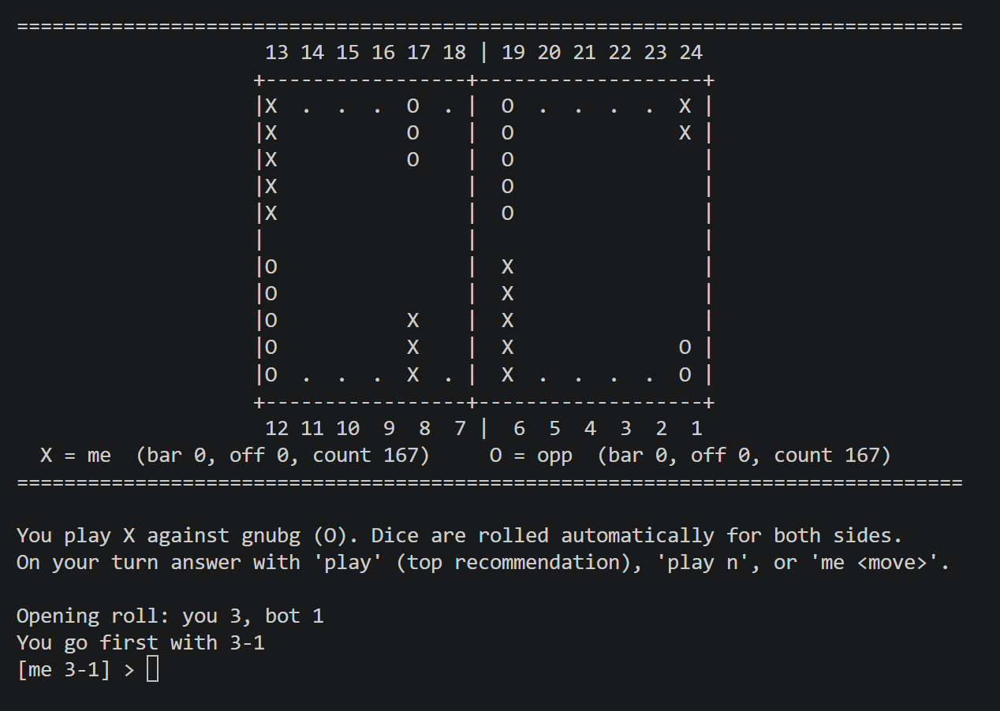

# bgcli - backgammon tutor

An interactive terminal front end for [GNU Backgammon](https://www.gnu.org/software/gnubg/).
Play against the gnubg bot, or track a real game and let gnubg tell you what it would play.



The board is printed from your point of view: you are `X` and move 24 -> 1, bearing off
from points 1-6. The opponent is `O`, moves 1 -> 24, enters from the bar onto 1-6 and bears
off from 19-24. The status line under the board shows, for each side, the checkers on the
bar, the checkers borne off and the pip count (167 each at the start).

## Requirements

- Python 3
- gnubg on your `PATH` (or pass `--gnubg /path/to/gnubg`)

```sh
sudo apt install gnubg      # Debian / Ubuntu / WSL
```

## Running

```sh
python3 bgcli.py                 # asks whether to play the bot or track a real game
python3 bgcli.py --mode bot      # play against gnubg
python3 bgcli.py --mode manual   # type the opponent's moves as they happen
```

| Option | Meaning |
| --- | --- |
| `--mode bot\|manual` | bot: play against gnubg. manual: track a real game. Default: ask. |
| `--plies N` | evaluation depth, 0-3. Default 2 (world class). |
| `--gnubg PATH` | path to the gnubg executable. Default: search `PATH`. |
| `--verbose` | print gnubg's raw output |
| `--selftest` | run the internal checks, no gnubg needed |

## Modes

**bot** - dice are rolled automatically for both sides and gnubg plays `O`. On your turn
type `play` to accept the top recommendation, `play n` for another line, or `me <move>` to
play your own idea. `hint` re-prints the recommendations.

**manual** - you sit at a real board. Enter the opponent's moves with `opp <move>`, enter
your roll (e.g. `31`), and the script prints what gnubg would play. Apply it with `play` or
enter what you actually played with `me <move>`.

## Typical session

All moves use the board numbers as printed. Hits are detected automatically when a checker
lands on a lone enemy checker, so the `*` is optional.

```
> opp 1/5 12/17         opponent moved; now it's your turn
> 31                    you rolled 3-1  -> recommendations printed
> play                  apply the top recommendation (or: play 2, or: me 8/5 6/5)
> opp 12/18*            opponent hit you
> 64                    ...
> board                 show the board any time
> help                  full command list
```

## Commands

| Command | Meaning |
| --- | --- |
| `start <mine> <theirs>` | opening roll, one die each, e.g. `start 5 3`. Automatic in bot mode. |
| `opp <move>` | opponent moved, e.g. `opp 1/5 12/17`, `opp bar/3*`, `opp 22/off` |
| `opp pass` | opponent had no legal move |
| `<dice>` | your roll, e.g. `31`, `6 6` or `roll 4-2`. Prints recommendations. |
| `roll` | bot mode only: force a roll after `undo` or `mode` |
| `mode bot\|manual` | switch between playing the bot and tracking a real game |
| `play [n]` | apply recommendation n (default 1) as your move |
| `me <move>` | apply your own move, e.g. `me 8/5 6/5` |
| `me pass` | you had no legal move |
| `hint` | re-run recommendations for the current roll |
| `cube` | ask gnubg about the cube (double / take) |
| `board` | show the board with the bar / off / pip count status line |
| `undo` | revert the last board change |
| `id` | print the gnubg position ID (you on roll) |
| `setid <ID>` | load a position from a gnubg position ID |
| `turn me\|opp` | fix whose turn it is |
| `new` | reset to the opening position |
| `raw` | toggle printing gnubg's raw output |
| `help`, `quit` | |

## Move notation

- `24/20 13/8` - two checkers moved
- `8/5(2)` - the same move played twice (doubles)
- `bar/22` - enter from the bar
- `6/off` - bear off
- `13/9*` - hit (the `*` is optional)

## Development

```sh
python3 bgcli.py --selftest
```

Runs the built-in checks for move parsing, hit detection, position IDs, pip counts and
gnubg output parsing. gnubg does not need to be installed.
